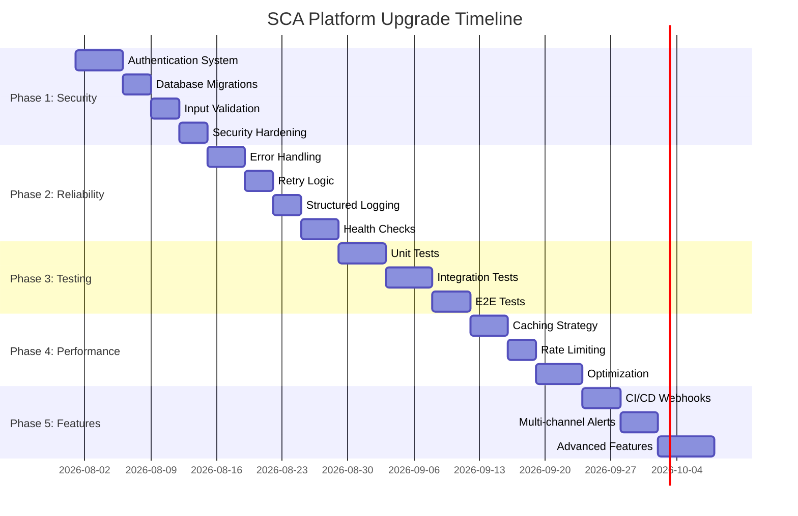

# 🚀 SCA Platform - Comprehensive Upgrade Plan

> **Prepared:** 2026-07-31  
> **Current Version:** 1.0.0  
> **Target Version:** 2.0.0  
> **Timeline:** 10 weeks (phased rollout)

---

## 📊 Current State Assessment

### ✅ Strengths
- Modern async stack (FastAPI + React 19)
- Clean architecture with separation of concerns
- Type safety (Pydantic + TypeScript)
- Unique Telegram integration with bot automation
- Docker-first deployment
- Combined scanning approach (SAST + Vulnerability + Secrets)

### ⚠️ Critical Gaps
| Priority | Issue | Impact | Risk Level |
|----------|-------|--------|------------|
| 🔴 P0 | No authentication system | Security breach, unauthorized access | **CRITICAL** |
| 🔴 P0 | No database migrations | Cannot evolve schema safely | **CRITICAL** |
| 🟠 P1 | No test coverage | Regressions, bugs in production | **HIGH** |
| 🟠 P1 | No monitoring/logging | Cannot diagnose issues | **HIGH** |
| 🟠 P1 | CORS wide open | CSRF attacks | **HIGH** |
| 🟡 P2 | No retry logic | Service instability | **MEDIUM** |
| 🟡 P2 | No resource cleanup | Disk space exhaustion | **MEDIUM** |
| 🟡 P2 | Poor error handling | Silent failures | **MEDIUM** |

---

## 🎯 Upgrade Strategy

### Phased Approach (10 Weeks)



---

## 📋 Phase 1: Foundation & Security (Week 1-2)

### 🔐 1.1 Authentication & Authorization

**Objective:** Implement JWT-based authentication with role-based access control

**Tasks:**
- [ ] Install dependencies: `python-jose[cryptography]`, `passlib[bcrypt]`
- [ ] Create User model with password hashing
- [ ] Implement JWT token generation/validation
- [ ] Add `/api/auth/register`, `/api/auth/login`, `/api/auth/refresh` endpoints
- [ ] Create authentication middleware
- [ ] Add role-based permissions (Admin, Analyst, Viewer)
- [ ] Protect all API routes with `Depends(get_current_user)`
- [ ] Frontend: Add login page, auth context, token storage
- [ ] Frontend: Add logout, token refresh logic

**Files to Create/Modify:**
```
backend/models/user.py          [NEW]
backend/schemas/auth.py         [NEW]
backend/api/routes/auth.py      [NEW]
backend/api/deps.py             [MODIFY] - add get_current_user
backend/config.py               [MODIFY] - add JWT_SECRET_KEY, JWT_ALGORITHM
frontend/src/contexts/AuthContext.tsx  [NEW]
frontend/src/pages/LoginPage.tsx       [NEW]
frontend/src/lib/api.ts         [MODIFY] - add interceptors
```

**Security Considerations:**
- Use bcrypt with cost factor 12 for password hashing
- JWT secret from environment variables (min 32 chars)
- Access token: 15 min expiry, Refresh token: 7 days
- Implement token blacklist in Redis for logout
- Add CSRF protection for cookie-based auth

---

### 🗄️ 1.2 Database Migrations with Alembic

**Objective:** Setup proper database migration system

**Tasks:**
- [ ] Initialize Alembic: `alembic init alembic`
- [ ] Configure `alembic.ini` to use async engine
- [ ] Create initial migration from current models
- [ ] Add migration for User table
- [ ] Add indexes for performance (scan.status, finding.severity, etc.)
- [ ] Setup migration CI check (detect missing migrations)
- [ ] Document migration workflow in README

**Commands:**
```bash
# Initialize
alembic init alembic

# Create initial migration
alembic revision --autogenerate -m "Initial schema"

# Apply migrations
alembic upgrade head

# Rollback
alembic downgrade -1
```

**Files to Create/Modify:**
```
alembic.ini                     [NEW]
alembic/env.py                  [NEW]
alembic/versions/001_initial.py [NEW]
backend/db/session.py           [MODIFY] - remove create_all()
docker-compose.yml              [MODIFY] - add migration step
```

---

### 🛡️ 1.3 Security Hardening

**Objective:** Fix critical security vulnerabilities

**Tasks:**

**A. Input Validation:**
- [ ] Add Pydantic validators for all user inputs
- [ ] Sanitize file paths (prevent directory traversal)
- [ ] Validate Git URLs (allow only https, block local paths)
- [ ] Add file upload limits (50MB max)
- [ ] Validate file types with magic bytes (not just extensions)
- [ ] Add ZIP bomb protection (max extracted size check)

**B. CORS Configuration:**
- [ ] Restrict CORS origins to specific domains
- [ ] Add environment-based CORS config (dev vs prod)
- [ ] Enable credentials only for authenticated endpoints

**C. Rate Limiting:**
- [ ] Install `slowapi` for rate limiting
- [ ] Add rate limits:
  - Auth endpoints: 5 req/min
  - Scan creation: 10 req/hour per user
  - General API: 100 req/min per IP
- [ ] Store rate limit state in Redis

**D. SQL Injection Prevention:**
- [ ] Audit all raw SQL queries (use ORM)
- [ ] Add SQLAlchemy query logging in dev
- [ ] Enable prepared statements

**E. Secrets Management:**
- [ ] Move sensitive configs to `.env` (never commit)
- [ ] Add `.env.example` with dummy values
- [ ] Validate required env vars on startup
- [ ] Add warning for default/weak JWT secrets

**Files to Modify:**
```
backend/config.py               [MODIFY] - add validators
backend/main.py                 [MODIFY] - restrict CORS
backend/api/routes/scans.py     [MODIFY] - add file validation
backend/schemas/*.py            [MODIFY] - add validators
requirements.txt                [MODIFY] - add slowapi
```

**Code Example - Rate Limiting:**
```python
from slowapi import Limiter, _rate_limit_exceeded_handler
from slowapi.util import get_remote_address
from slowapi.errors import RateLimitExceeded

limiter = Limiter(key_func=get_remote_address, storage_uri=settings.REDIS_URL)
app.state.limiter = limiter
app.add_exception_handler(RateLimitExceeded, _rate_limit_exceeded_handler)

@router.post("/scans")
@limiter.limit("10/hour")
async def create_scan(...):
    ...
```

---

## 📋 Phase 2: Reliability & Observability (Week 3-4)

### 🔄 2.1 Error Handling & Retry Logic

**Objective:** Graceful failure handling and automatic recovery

**Tasks:**

**A. Structured Error Handling:**
- [ ] Create custom exception hierarchy
- [ ] Add global exception handler in FastAPI
- [ ] Return consistent error responses (RFC 7807)
- [ ] Log all exceptions with context
- [ ] Add error tracking (Sentry optional)

**B. Retry Logic:**
- [ ] Install `tenacity` for retry decorators
- [ ] Add retry for Telegram API calls (exponential backoff)
- [ ] Add retry for Git clone operations
- [ ] Add retry for Docker scanner execution
- [ ] Implement circuit breaker for external services

**C. Scan State Management:**
- [ ] Add transaction rollback on scan failure
- [ ] Update scan status to "failed" with error details
- [ ] Add cleanup on partial scan completion
- [ ] Implement scan timeout with graceful termination

**Files to Create/Modify:**
```
backend/core/exceptions.py      [NEW]
backend/core/retry.py           [NEW]
backend/api/error_handlers.py   [NEW]
backend/main.py                 [MODIFY]
backend/utils/telegram.py       [MODIFY] - add retry
backend/workers/tasks.py        [MODIFY] - add error handling
requirements.txt                [MODIFY] - add tenacity
```

**Code Example - Retry Logic:**
```python
from tenacity import retry, stop_after_attempt, wait_exponential

@retry(
    stop=stop_after_attempt(3),
    wait=wait_exponential(multiplier=1, min=2, max=10),
    reraise=True
)
def send_telegram_notification(message: str):
    # API call with automatic retry
    ...
```

---

### 📊 2.2 Structured Logging & Monitoring

**Objective:** Production-grade observability

**Tasks:**

**A. Structured Logging:**
- [ ] Replace print statements with `loguru`
- [ ] Add correlation IDs (trace requests across services)
- [ ] Log levels: DEBUG (dev), INFO (prod), ERROR (always)
- [ ] JSON logging format for production
- [ ] Add request/response logging middleware
- [ ] Log scan lifecycle events

**B. Metrics Collection:**
- [ ] Add Prometheus metrics endpoint (`/metrics`)
- [ ] Track metrics:
  - Scan duration by type
  - Finding count by severity
  - API request latency
  - Celery queue length
  - Scanner success/failure rate
- [ ] Add Grafana dashboard template

**C. Health Checks:**
- [ ] Enhanced `/api/health` endpoint
- [ ] Check DB connectivity
- [ ] Check Redis connectivity
- [ ] Check Celery worker status
- [ ] Check disk space for scan workspaces
- [ ] Add readiness vs liveness probes

**Files to Create/Modify:**
```
backend/core/logging.py         [NEW]
backend/core/metrics.py         [NEW]
backend/api/routes/health.py    [NEW]
backend/middleware/logging.py   [NEW]
backend/main.py                 [MODIFY]
requirements.txt                [MODIFY] - add loguru, prometheus-client
docker-compose.yml              [MODIFY] - add Prometheus, Grafana
grafana/dashboards/sca.json     [NEW]
```

**Code Example - Structured Logging:**
```python
from loguru import logger
import sys

logger.remove()
logger.add(
    sys.stdout,
    format="<green>{time:YYYY-MM-DD HH:mm:ss}</green> | <level>{level: <8}</level> | <cyan>{name}</cyan>:<cyan>{function}</cyan> | {extra[correlation_id]} | <level>{message}</level>",
    level="INFO",
    serialize=True  # JSON in production
)

logger.info("Scan started", scan_id=scan.id, project_id=project.id)
```

---

### 🧹 2.3 Resource Cleanup

**Objective:** Prevent disk space exhaustion

**Tasks:**
- [ ] Add cleanup job for scan workspaces > 7 days old
- [ ] Add cleanup for failed scans
- [ ] Add database cleanup for old findings (archive strategy)
- [ ] Monitor workspace disk usage
- [ ] Add alerts for low disk space
- [ ] Implement scan result compression (old scans)

**Files to Create/Modify:**
```
backend/workers/cleanup_tasks.py [NEW]
backend/workers/celery_app.py    [MODIFY] - add scheduled tasks
backend/utils/storage.py         [NEW]
```

**Celery Beat Schedule:**
```python
celery_app.conf.beat_schedule = {
    'cleanup-old-workspaces': {
        'task': 'workers.cleanup_tasks.cleanup_old_workspaces',
        'schedule': crontab(hour=2, minute=0),  # Daily at 2 AM
    },
}
```

---

## 📋 Phase 3: Testing & Quality (Week 5-6)

### 🧪 3.1 Unit Tests

**Objective:** 80%+ code coverage

**Tasks:**
- [ ] Setup pytest with async support
- [ ] Add pytest fixtures for DB, mocks
- [ ] Test all parsers (opengrep, trivy, trufflehog, etc.)
- [ ] Test models (validation, relationships)
- [ ] Test schemas (Pydantic validation)
- [ ] Test utility functions
- [ ] Add coverage reporting with `pytest-cov`
- [ ] Add pre-commit hook to run tests

**Files to Create:**
```
backend/tests/__init__.py
backend/tests/conftest.py                    [fixtures]
backend/tests/test_parsers/
  test_opengrep_parser.py
  test_trivy_parser.py
  test_trufflehog_parser.py
backend/tests/test_models/
  test_project.py
  test_scan.py
  test_finding.py
backend/tests/test_services/
  test_scan_service.py
backend/tests/test_utils/
  test_scanner_utils.py
  test_telegram.py
pytest.ini
.coveragerc
```

**Test Example:**
```python
import pytest
from services.parsers.trivy_parser import parse_trivy_results

def test_parse_trivy_results_with_vulnerabilities():
    mock_output = {
        "Results": [{
            "Vulnerabilities": [{
                "VulnerabilityID": "CVE-2023-12345",
                "Severity": "HIGH",
                "PkgName": "requests",
                "InstalledVersion": "2.28.0",
                "FixedVersion": "2.31.0"
            }]
        }]
    }
    
    findings = parse_trivy_results(mock_output)
    
    assert len(findings) == 1
    assert findings[0]["severity"] == "high"
    assert findings[0]["cve_id"] == "CVE-2023-12345"
```

---

### 🔗 3.2 Integration Tests

**Objective:** Test API endpoints and database interactions

**Tasks:**
- [ ] Setup test database (PostgreSQL in Docker)
- [ ] Test all API endpoints with authentication
- [ ] Test CRUD operations for projects, scans, findings
- [ ] Test scan workflow (create → run → complete)
- [ ] Test error scenarios (invalid inputs, missing data)
- [ ] Test pagination and filtering
- [ ] Mock external services (Telegram, Docker)

**Files to Create:**
```
backend/tests/integration/__init__.py
backend/tests/integration/conftest.py
backend/tests/integration/test_projects_api.py
backend/tests/integration/test_scans_api.py
backend/tests/integration/test_findings_api.py
backend/tests/integration/test_auth_api.py
docker-compose.test.yml          [NEW]
```

---

### 🌐 3.3 E2E Tests

**Objective:** Test full user workflows

**Tasks:**
- [ ] Setup Playwright for frontend E2E tests
- [ ] Test user login flow
- [ ] Test project creation and scan trigger
- [ ] Test scan result viewing
- [ ] Test file upload for local scans
- [ ] Run E2E tests in CI pipeline

**Files to Create:**
```
frontend/e2e/
  login.spec.ts
  project-creation.spec.ts
  scan-workflow.spec.ts
playwright.config.ts
```

---

## 📋 Phase 4: Performance & Scale (Week 7-8)

### ⚡ 4.1 Caching Strategy

**Tasks:**
- [ ] Add Redis caching for dashboard stats (5 min TTL)
- [ ] Cache project list with invalidation on update
- [ ] Cache scan results for completed scans
- [ ] Add cache warming for frequently accessed data
- [ ] Implement cache-aside pattern

**Code Example:**
```python
from functools import wraps
import redis

def cache(key_prefix: str, ttl: int = 300):
    def decorator(func):
        @wraps(func)
        async def wrapper(*args, **kwargs):
            cache_key = f"{key_prefix}:{hash(str(args) + str(kwargs))}"
            cached = await redis_client.get(cache_key)
            if cached:
                return json.loads(cached)
            
            result = await func(*args, **kwargs)
            await redis_client.setex(cache_key, ttl, json.dumps(result))
            return result
        return wrapper
    return decorator
```

---

### 🚦 4.2 Rate Limiting (Enhanced)

**Tasks:**
- [ ] Per-user rate limits (track by user_id)
- [ ] Different limits for different roles
- [ ] Rate limit dashboard in admin UI
- [ ] Add rate limit headers in responses
- [ ] Implement token bucket algorithm

---

### 📁 4.3 File Streaming

**Tasks:**
- [ ] Stream large file uploads (avoid loading in memory)
- [ ] Use `aiofiles` for async file I/O
- [ ] Add progress tracking for uploads
- [ ] Implement chunked uploads for files > 10MB

---

### 🔧 4.4 Scanner Optimization

**Tasks:**
- [ ] Run compatible scanners in parallel (not sequential)
- [ ] Add incremental scanning (only changed files)
- [ ] Cache scanner results (same repo + commit hash)
- [ ] Add scan priority queue
- [ ] Optimize Docker image pulls (cache locally)

---

## 📋 Phase 5: Features & UX (Week 9-10)

### 🔗 5.1 CI/CD Integration

**Tasks:**
- [ ] Add GitHub webhook endpoint
- [ ] Add GitLab webhook endpoint
- [ ] Trigger scans on push to monitored branches
- [ ] Post scan results as PR comments
- [ ] Add commit status checks (pass/fail based on findings)
- [ ] Support manual webhook registration UI

**Files to Create:**
```
backend/api/routes/webhooks.py   [NEW]
backend/services/webhook_service.py [NEW]
backend/schemas/webhook.py       [NEW]
```

---

### 📧 5.2 Multi-Channel Notifications

**Tasks:**
- [ ] Add email notifications (SMTP)
- [ ] Add Slack webhook integration
- [ ] Add Microsoft Teams webhook
- [ ] Add Discord webhook
- [ ] Make notification channels configurable per project
- [ ] Add notification templates
- [ ] Support notification rules (e.g., only critical findings)

---

### 🎨 5.3 Advanced Features

**Tasks:**
- [ ] Custom scan profiles (configure which scanners to run)
- [ ] Baseline management (mark findings as accepted risk)
- [ ] JIRA integration (create tickets for findings)
- [ ] Export findings to SARIF format
- [ ] Advanced filtering (by CWE, OWASP Top 10)
- [ ] Scan scheduling (cron-based recurring scans)
- [ ] API key management for external integrations
- [ ] Audit logs (track all user actions)

---

## 📦 Dependencies to Add

### Backend
```txt
# Authentication
python-jose[cryptography]==3.3.0
passlib[bcrypt]==1.7.4

# Retry & Resilience
tenacity==8.2.3

# Logging & Monitoring
loguru==0.7.2
prometheus-client==0.19.0
sentry-sdk==1.40.0

# Rate Limiting
slowapi==0.1.9

# Testing
pytest==7.4.3
pytest-asyncio==0.21.1
pytest-cov==4.1.0
httpx==0.27.0  # for test client
faker==22.0.0

# Async File I/O
aiofiles==23.2.1

# Database
alembic==1.13.1
```

### Frontend
```json
{
  "axios-auth-refresh": "^3.3.6",
  "react-hook-form": "^7.49.3",
  "zod": "^3.22.4",
  "@hookform/resolvers": "^3.3.4",
  "react-toastify": "^10.0.4",
  "@playwright/test": "^1.40.1"
}
```

---

## 🚀 Deployment Checklist

### Pre-Production
- [ ] Run all tests (unit + integration + E2E)
- [ ] Security audit (OWASP ZAP scan)
- [ ] Performance testing (load test with k6)
- [ ] Database backup strategy
- [ ] Rollback plan documented
- [ ] Monitoring dashboards configured
- [ ] Alerts configured (PagerDuty/Opsgenie)

### Production
- [ ] Run database migrations
- [ ] Update environment variables
- [ ] Deploy backend first
- [ ] Deploy frontend
- [ ] Run smoke tests
- [ ] Monitor error rates for 24h
- [ ] Gradual rollout (canary deployment)

---

## 📈 Success Metrics

| Metric | Current | Target | Measurement |
|--------|---------|--------|-------------|
| Test Coverage | 0% | 80%+ | pytest-cov |
| API Response Time (p95) | Unknown | < 200ms | Prometheus |
| Scan Success Rate | Unknown | > 95% | Metrics |
| Security Score | F | A | OWASP ZAP |
| Uptime | Unknown | 99.5% | Monitoring |
| MTTR | Unknown | < 30 min | Incident tracking |

---

## 🔄 Migration Strategy

### Database Migration Plan
1. **Week 1:** Setup Alembic, create initial migration
2. **Week 2:** Test migrations on staging
3. **Week 3:** Apply to production (maintenance window)

### Zero-Downtime Deployment
1. Deploy new backend alongside old (blue-green)
2. Run database migrations (backward compatible)
3. Switch traffic to new backend
4. Monitor for 1 hour
5. Decommission old backend

---

## 📚 Documentation Updates Needed

- [ ] Update README with new features
- [ ] Add CONTRIBUTING.md with development setup
- [ ] Add API documentation (OpenAPI/Swagger)
- [ ] Add architecture diagrams (C4 model)
- [ ] Add runbook for operators
- [ ] Add troubleshooting guide
- [ ] Add security policy (SECURITY.md)
- [ ] Add changelog (CHANGELOG.md)

---

## 💰 Cost Estimate

### Development Time
- Phase 1: 2 weeks (80 hours)
- Phase 2: 2 weeks (80 hours)
- Phase 3: 2 weeks (80 hours)
- Phase 4: 2 weeks (80 hours)
- Phase 5: 2 weeks (80 hours)
**Total: 10 weeks (400 hours)**

### Infrastructure (Monthly)
- Monitoring (Grafana Cloud): $0 (free tier)
- Error Tracking (Sentry): $0 (free tier)
- CI/CD (GitHub Actions): $0 (free tier for public repos)
**Total: $0 (using free tiers)**

---

## 🎯 Priority Matrix

```
High Impact, High Urgency:
- Authentication system
- Database migrations
- Security hardening

High Impact, Low Urgency:
- Monitoring & logging
- Test coverage
- Caching

Low Impact, High Urgency:
- Bug fixes
- Documentation

Low Impact, Low Urgency:
- Advanced features
- UI polish
```

---

## 📞 Next Steps

1. **Review this plan** with stakeholders
2. **Prioritize phases** based on business needs
3. **Assign team members** to each phase
4. **Setup project tracking** (Jira/Linear)
5. **Create feature branches** for each phase
6. **Start with Phase 1** (Security is critical!)

---

**Questions? Contact:** [Your Team]  
**Plan Version:** 1.0  
**Last Updated:** 2026-07-31
